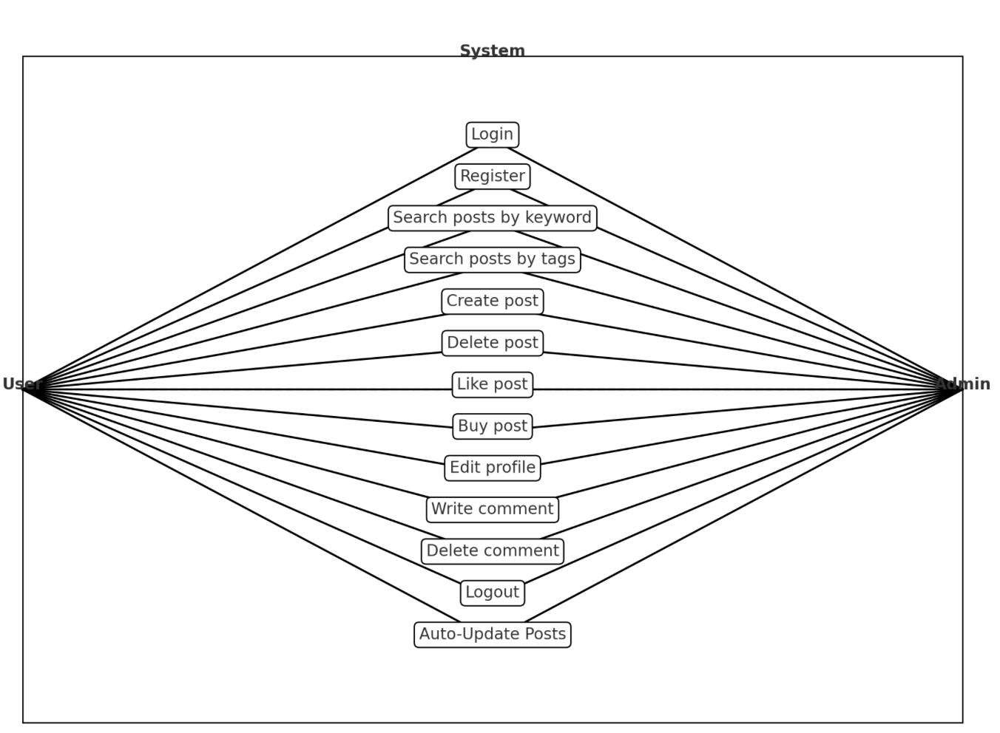

# [G58 - Team Name] Report

The following is a report template to help your team successfully provide all the details necessary for your report in a structured and organised manner. Please give a straightforward and concise report that best demonstrates your project. Note that a good report will give a better impression of your project to the reviewers.

Note that you should have removed ALL TEMPLATE/INSTRUCTION textes in your submission (like the current sentence), otherwise it hampers the professionality in your documentation.

*Here are some tips to write a good report:*

* `Bullet points` are allowed and strongly encouraged for this report. Try to summarise and list the highlights of your project (rather than give long paragraphs).*

* *Try to create `diagrams` for parts that could greatly benefit from it.*

* *Try to make your report `well structured`, which is easier for the reviewers to capture the necessary information.*

*We give instructions enclosed in square brackets [...] and examples for each sections to demonstrate what are expected for your project report. Note that they only provide part of the skeleton and your description should be more content-rich. Quick references about markdown by [CommonMark](https://commonmark.org/help/)*

## Table of Contents

1. [Team Members and Roles](#team-members-and-roles)
2. [Summary of Individual Contributions](#summary-of-individual-contributions)
3. [Application Description](#application-description)
4. [Application UML](#application-uml)
5. [Application Design and Decisions](#application-design-and-decisions)
6. [Summary of Known Errors and Bugs](#summary-of-known-errors-and-bugs)
7. [Testing Summary](#testing-summary)
8. [Implemented Features](#implemented-features)
9. [Team Meetings](#team-meetings)
10. [Conflict Resolution Protocol](#conflict-resolution-protocol)

## Administrative
- Firebase Repository Link: 
   - https://console.firebase.google.com/u/1/project/login-register-firebase-94766/overview
   - Confirm: I have already added comp21006442@gmail.com as a Developer to the Firebase project prior to due date.
- Two user accounts for markers' access are usable on the app's APK (do not change the username and password unless there are exceptional circumstances. Note that they are not real e-mail addresses in use):
   - Username: comp2100@anu.edu.au	Password: comp2100
   - Username: comp6442@anu.edu.au	Password: comp6442

## Team Members and Roles
The key area(s) of responsibilities for each member

| UID      |     Name      |      Role |
|:---------|:-------------:|----------:|
| u7633783 |  Linxiang Hu  |  Back-end |
| u7773637 |  Wenhui Shi   | Front-end |
| u7670526 | Yingxuan Tang |  Back-end |
| u7724192 |   Jin Yang    | Front-end |
| u7748799 |  Yichi Zhang  |  Back-end |

## Summary of Individual Contributions

Specific details of individual contribution of each member to the project.

Each team member is responsible for writing **their own subsection**.

A generic summary will not be acceptable and may result in a significant lose of marks.

*[Summarise the contributions made by each member to the project, e.g. code implementation, code design, UI design, report writing, etc.]*

*[Code Implementation. Which features did you implement? Which classes or methods was each member involved in? Provide an approximate proportion in pecentage of the contribution of each member to the whole code implementation, e.g. 30%.]*

*you should ALSO provide links to the specified classes and/or functions*
Note that the core criteria of contribution is based on `code contribution` (the technical developing of the App).

*Here is an example: (Note that you should remove the entire section (e.g. "others") if it is not applicable)*

1. **UID1, Name1**  I have 30% contribution, as follows:  
  - **Code Contribution in the final App**
    - Feature A1, A2, A3 - class Dummy: [Dummy.java](https://gitlab.cecs.anu.edu.au/comp2100/group-project/ga-23s2/-/blob/main/items/media/_examples/Dummy.java)
    - XYZ Design Pattern -  class AnotherClass: [functionOne()](https://gitlab.cecs.anu.edu.au/comp2100/group-project/ga-23s2/-/blob/main/items/media/_examples/Dummy.java#L22-43), [function2()](the-URL)
    - ... (any other contribution in the code, including UI and data files) ... [Student class](../src/path/to/class/Student.java), ..., etc.*, [LanguageTranslator class](../src/path/to/class/LanguageTranslator.java): function1(), function2(), ...   

  - **Code and App Design** 
    - [What design patterns, data structures, did the involved member propose?]*
    - [UI Design. Specify what design did the involved member propose? What tools were used for the design?]*   

  - **Others**: (only if significant and significantly different from an "average contribution") 
    - [Report Writing?] [Slides preparation?]*
    - [You are welcome to provide anything that you consider as a contribution to the project or team.] e.g., APK, setups, firebase*   

2. **UID2, Name2**  I have xx% contribution, as follows:  
  - ...

3. **U7670526, Yingxuan Tang**  I have 20% contribution, as follows:  
  - **Code Contribution in the final App**
  - 

## Application Description

*[What is your application, what does it do? Include photos or diagrams if necessary]*

*Green Book is a platform that revitalizes the concept of second-hand trading, aiming to encourage the recycling and reuse of items by connecting buyers and sellers. This initiative helps individuals easily find quality second-hand goods and offers sellers a space to rehome their pre-owned items. The platform is not just about buying and selling; it's a movement towards sustainable consumption and minimizing waste, in line with the United Nations' Sustainable Development Goal 12: Responsible Consumption and Production.*

*The user interface is crafted for ease, allowing sellers to set up listings complete with detailed descriptions, quality photos, and appropriate tags to enhance discoverability. For buyers, the platform provides tools to search for specific items, navigate through categories, and apply filters like location, price range, and item condition. Green Book also integrates a direct messaging system for seamless communication between buyers and sellers, facilitating inquiries and price negotiations.*

*By bridging the gap between those looking to find new homes for their cherished items and those seeking sustainable purchasing options, Green Book fosters a community committed to eco-friendly consumption practices.*

### Application Use Cases and or Examples
*[Provide use cases and examples of people using your application. Who are the target users of your application? How do the users use your application?]*
* use case diagram
  
* System User Profile  

| No. | User Role | Responsibilities                                    | Branch/Division/Section/Unit | Staff Post/Rank | Stakeholder Group                |
|-----|-----------|-----------------------------------------------------|------------------------------|-----------------|----------------------------------|
| 1   | Admin     | Responsible for overseeing the whole system         | Admin                        | Super           | Reservation and system manager   |
| 2   | User      | Responsible for creating, liking, and buying posts. | User                         | Lower           | Normal user                      |

Use Case Authorization Table 

| Use Case                    | Authorized User Type  |
|-----------------------------|-----------------------|
| 1. Login                    | Admin, User           |
| 2. Register                 | Admin, User           |
| 3. Search posts by keyword  | Admin, User           |
| 4. Search posts by tags     | Admin, User           |
| 5. Create post              | Admin, User           |
| 6. Delete post              | Admin, User           |
| 7. Like post                | Admin, User           |
| 8. Buy post                 | Admin, User           |
| 9. Edit profile             | Admin, User           |
| 10. Write comment           | Admin, User           |
| 11. Delete comment          | Admin, User           |
| 12. Logout                  | Admin, User           |
| 13. Auto-Update Posts       | Admin, User           |

* Case Narrative 

| Use Case 1            | Login                                                                                                                         |
|-----------------------|-------------------------------------------------------------------------------------------------------------------------------|
| Goal in context       | To allow a user to securely access their Green Book account.                                                                  |
| Precondition          | The user must have a registered account with valid credentials.                                                               |
| Success End Condition | The user is successfully logged into the Green Book platform and redirected to the home page.                                 |
| Failed End Condition  | The user is not logged in and remains on the login page,with an error message.                                                |
| Actor                 | User                                                                                                                          |
| Description           | Step 1. User opens the Green Book app.                                                                                        |
|                       | Step 2. User clicks the "Get Started" button.                                                                                 |
|                       | Step 3. User navigates to the login page.                                                                                     |
|                       | Step 4. User enters their email and password.                                                                                 |
|                       | Step 5. User clicks the "Login" button.                                                                                       |
|                       | Step 6. System validates the credentials.                                                                                     |
|                       | Step 7. If credentials are correct, user is logged in and redirected to the home page displaying random recommendation posts. |
|                       | Step 8. If credentials are incorrect, system displays an error message.                                                       |

| Use Case 2            | Register                                                                                                              |
|-----------------------|-----------------------------------------------------------------------------------------------------------------------|
| Goal in context       | To allow a user to create an account on the Green Book platform.                                                      |
| Precondition          | The user has an email address that has not been registered on the Green Book app.                                     |
| Success End Condition | The user successfully creates a new account and is redirected to the login&register page.                             |
| Failed End Condition  | The user is not registered and remains on the registration page, with an error message.                               |
| Actor                 | User                                                                                                                  |
| Description           | Step 1. User opens the Green Book app.                                                                                |
|                       | Step 2. User clicks the "Get Started" button.                                                                         |
|                       | Step 3. User navigates to the login page.                                                                             |
|                       | Step 4. User clicks the "Register" button.                                                                            |
|                       | Step 5. User navigates to the register page.                                                                          |
|                       | Step 6. User enters required information (e.g.,email, password).                                                      |
|                       | Step 7. User clicks the "Register" button.                                                                            |
|                       | Step 8. System validates the input information.                                                                       |
|                       | Step 9. If information is valid, system creates a new account and redirect the user to the login page let user login. |
|                       | Step 10. If information is invalid (e.g., email already in use), system displays an error message.                    |
| Extension             | 5a. User doesn't want to register.                                                                                    |
|                       | Step 5a1. User clicks on the retuen image.                                                                            |
|                       | Step 5a2. App redirects user to login page.                                                                           |
| Registration Rules    | - Email must be unregistered on the platform.                                                                         |
|                       | - Password must contain: numbers, lowercase letters, uppercase letters, and special symbols (_@!?#$%^&+=).            |
|                       | - Password cannot contain spaces.                                                                                     |
|                       | - Password must be 8-20 characters long.                                                                              |

| Use Case 3            | Search Posts by Keyword                                                                               |
|-----------------------|-------------------------------------------------------------------------------------------------------|
| Goal in context       | To allow a user to search for posts using specific keywords.                                          |
| Precondition          | The user is logged into the Green Book APP and is on the search page.                                 |
| Success End Condition | The user is presented with a list of posts that match the entered keyword.                            |
| Failed End Condition  | The user is shown a message indicating that no posts match the search criteria.                       |
| Actor                 | User                                                                                                  |
| Description           | Step 1. User opens the Green Book app and logs in if not already logged in.                           |
|                       | Step 2. User navigates to the search page.                                                            |
|                       | Step 3. User enters a keyword into the search bar.                                                    |
|                       | Step 4. User clicks the "Search" button.                                                              |
|                       | Step 5. System processes the keyword and searches for matching posts.                                 |
|                       | Step 6. If matching posts are found, system displays the list of posts to the user.                   |
|                       | Step 7. If no matching posts are found, system displays a message indicating no results were found.   |

| Use Case 4            | Search Posts by Tags                                                                                                                                          |
|-----------------------|---------------------------------------------------------------------------------------------------------------------------------------------------------------|
| Goal in context       | To allow a user to search for posts using specific tags.                                                                                                      |
| Precondition          | The user is logged into the Green Book App and is on the search page.                                                                                         |
| Success End Condition | The user is presented with a list of posts that match the selected tags.                                                                                      |
| Failed End Condition  | The user is shown a message indicating that no posts match the search criteria.                                                                               |
| Actor                 | User                                                                                                                                                          |
| Description           | Step 1. User logs into the Green Book app.                                                                                                                    |
|                       | Step 2. User navigates to the search page.                                                                                                                    |
|                       | Step 3. User clicks the "Tag Search" button.                                                                                                                  |
|                       | Step 4. App displays the tag selection interface with various categories (Gender, MasterCategory, SubCategory, ArticleType, BaseColor, Season, Usage, Price). |
|                       | Step 5. User selects desired tags from each category.                                                                                                         |
|                       | Step 6. User enters the price range (min and max price).                                                                                                      |
|                       | Step 7. User clicks the "Save" button.                                                                                                                        |
|                       | Step 8. App redirects user to the search page.                                                                                                                |
|                       | Step 9. User clicks the "Go" button to initiate the search.                                                                                                   |
|                       | Step 10. System processes the selected tags and price range, then searches for matching posts.                                                                |
|                       | Step 11. If matching posts are found, system displays the list of posts on the search page.                                                                   |
|                       | Step 12. If no matching posts are found, system displays a message indicating no results were found.                                                          |
| Extension             | 5a. User decides to cancle search by tags.                                                                                                                    |
|                       | Step 5a1. User clicks the "Cancle" button.                                                                                                                    |
|                       | Step 5a2. App redirects user to the search page.                                                                                                              |

| Use Case 5            | Create Post                                                                                                           |
|-----------------------|-----------------------------------------------------------------------------------------------------------------------|
| Goal in context       | To allow a user to create a new post on the Green Book App.                                                           |
| Precondition          | The user is logged into the Green Book platform and is on the create post page.                                       |
| Success End Condition | The new post is successfully created and visible on the user's profile page.                                          |
| Failed End Condition  | The post is not created and the user remains on the create post page, with an error message.                          |
| Actor                 | User                                                                                                                  |
| Description           | Step 1. User logs into the Green Book app.                                                                            |
|                       | Step 2. User navigates to the create post page.                                                                       |
|                       | Step 3. User enters the following information:                                                                        |
|                       | - image                                                                                                               |
|                       | - gender                                                                                                              |
|                       | - masterCategory                                                                                                      |
|                       | - subCategory                                                                                                         |
|                       | - articleType                                                                                                         |
|                       | - baseColour                                                                                                          |
|                       | - season                                                                                                              |
|                       | - year                                                                                                                |
|                       | - usage                                                                                                               |
|                       | - productDisplayName                                                                                                  |
|                       | - price                                                                                                               |
|                       | - status                                                                                                              |
|                       | - description                                                                                                         |
|                       | - commentText                                                                                                         |
|                       | Step 4. User can click the "Return" button if they decide not to create a post.                                       |
|                       | Step 5. User can click the "Apply Default Values" button to quickly enter pre-defined values for each field.          |
|                       | Step 6. User clicks the "Create" button to submit the new post.                                                       |
|                       | Step 7. System validates the input information.                                                                       |
|                       | Step 8. If information is valid, system creates the new post and updates the user's profile page with the new post.   |
|                       | Step 9. User can view the new post on their profile page.                                                             |
|                       | Step 10. If information is invalid, system displays an error message and prompts the user to correct the information. |
| Extension             | 4a. User decides to cancel post creation.                                                                             |
|                       | Step 4a1. User clicks the "Return" button.                                                                            |
|                       | Step 4a2. System returns the user to the previous page without saving any information.                                |
|                       | 5a. User applies default values.                                                                                      |
|                       | Step 5a1. User clicks the "Apply Default Values" button.                                                              |
|                       | Step 5a2. System populates the fields with default values.                                                            |
|                       | Step 5a3. User reviews and optionally edits the values before clicking the "Create" button.                           |

| Use Case 6            | Delete Post                                                                                                                      |
|-----------------------|----------------------------------------------------------------------------------------------------------------------------------|
| Goal in context       | To allow a user to delete their own post on the Green Book App.                                                                  |
| Precondition          | The user is logged into the Green Book app and is on their profile page.                                                         |
| Success End Condition | The selected post is successfully deleted and the user is redirected to the profile page.                                        |
| Failed End Condition  | The post is not deleted and the user remains on the post detail page.                                                            |
| Actor                 | User                                                                                                                             |
| Description           | Step 1. User logs into the Green Book app.                                                                                       |
|                       | Step 2. User navigates to their profile page.                                                                                    |
|                       | Step 3. User views their list of own posts.                                                                                      |
|                       | Step 4. User selects the post they want to delete.                                                                               |
|                       | Step 5. App directs the user to the post detail page.                                                                            |
|                       | Step 6. User clicks the "Delete" button on the post detail page.                                                                 |
|                       | Step 7. System displays a confirmation pop-up window asking if the user really wants to delete the post.                         |
|                       | Step 8. User chooses "Yes" to confirm deletion.                                                                                  |
|                       | Step 9. System deletes the post and redirects the user to their profile page.                                                    |
|                       | Step 10. User sees the updated post list on their profile page without the deleted post.                                         |
|                       | Step 11. If user chooses "No" in the confirmation pop-up, the pop-up window closes and the user remains on the post detail page. |
| Extension             | 8a. User decides not to delete the post.                                                                                         |
|                       | Step 8a1. User clicks "No" in the confirmation pop-up.                                                                           |
|                       | Step 8a2. System closes the pop-up window.                                                                                       |
|                       | Step 8a3. User remains on the post detail page.                                                                                  |

| Use Case 7            | Like Post                                                                                                                                  |
|-----------------------|--------------------------------------------------------------------------------------------------------------------------------------------|
| Goal in context       | To allow a user to like a post on the Green Book App.                                                                                      |
| Precondition          | The user is logged into the Green Book App and is on the post detail page.                                                                 |
| Success End Condition | The post is liked, the heart image turns red, and the post is added to the user's liked posts list displayed on their profile page.        |
| Failed End Condition  | N/A                                                                                                                                        |
| Actor                 | User                                                                                                                                       |
| Description           | Step 1. User logs into the Green Book app or website.                                                                                      |
|                       | Step 2. User navigates to the post detail page.                                                                                            |
|                       | Step 3. User views the post detail and sees the heart image.                                                                               |
|                       | Step 4. User clicks the heart image to like the post.                                                                                      |
|                       | Step 5. System processes the like action.                                                                                                  |
|                       | Step 6. If the like action is successful, the heart image turns red and a message is displayed indicating the post was liked successfully. |
|                       | Step 7. System updates the user's liked posts list and displays the liked post on the user's profile page.                                 |
| Extension             | 4a. User tries to like a post they have already liked.                                                                                     |
|                       | Step 4a1. System checks whether user like this post before.                                                                                |
|                       | Step 4a2. Can't like twice.                                                                                                                |

| Use Case 8            | Buy Post                                                                                                                                      |
|-----------------------|-----------------------------------------------------------------------------------------------------------------------------------------------|
| Goal in context       | To allow a user to purchase a post on the Green Book platform.                                                                                |
| Precondition          | The user is logged into the Green Book platform and is on the post detail page.                                                               |
| Success End Condition | The post is purchased, a success message is displayed, and the post is added to the user's bought posts list displayed on their profile page. |
| Failed End Condition  | The post is not purchased, and the user remains on the post detail page.                                                                      |
| Actor                 | User                                                                                                                                          |
| Description           | Step 1. User logs into the Green Book app or website.                                                                                         |
|                       | Step 2. User navigates to the post detail page.                                                                                               |
|                       | Step 3. User views the post detail and sees the "Buy Now" button.                                                                             |
|                       | Step 4. User clicks the "Buy Now" button to purchase the post.                                                                                |
|                       | Step 5. System processes the purchase action.                                                                                                 |
|                       | Step 6. If the purchase action is successful, a message is displayed indicating the post was bought successfully.                             |
|                       | Step 7. System updates the user's bought posts list and displays the bought post on the user's profile page.                                  |
|                       | Step 8. If the purchase action fails, the system displays an error message and the user remains on the post detail page.                      |
| Extension             | 4a. User decides to cancel the purchase process.                                                                                              |
|                       | Step 4a1. User clicks the "Cancel" button or navigates away from the post detail page.                                                        |
|                       | Step 4a2. System cancels the purchase process and the user remains on the post detail page.                                                   |

| Use Case 9            | Edit Profile                                                                                                           |
|-----------------------|------------------------------------------------------------------------------------------------------------------------|
| Goal in context       | To allow a user to edit their profile information on the Green Book app.                                               |
| Precondition          | The user is logged into the Green Book platform and is on their profile page.                                          |
| Success End Condition | The profile information is updated successfully, and the user is redirected to the profile page.                       |
| Failed End Condition  | The profile information is not updated, and the user remains on the edit profile page, with an error message.          |
| Actor                 | User                                                                                                                   |
| Description           | Step 1. User logs into the Green Book app.                                                                             |
|                       | Step 2. User navigates to their profile page.                                                                          |
|                       | Step 3. User clicks the "Edit Profile" button.                                                                         |
|                       | Step 4. App directs the user to the edit profile page.                                                                 |
|                       | Step 5. User changes one or more of the following fields: name, password, address, phone.                              |
|                       | Step 6. User clicks the "Save Changes" button.                                                                         |
|                       | Step 7. System validates the input information.                                                                        |
|                       | Step 8. If the information is valid, the system updates the user's profile and redirects the user to the profile page. |
|                       | Step 9. User sees the updated profile information on their profile page.                                               |
|                       | Step 10. If the information is invalid, the system displays an error message.                                          |
|                       | Step 11. User can click the "Return" button if they decide not to make any changes.                                    |
| Extension             | 6a. User decides not to save changes.                                                                                  |
|                       | Step 6a1. User clicks the "Return" button from the edit profile page.                                                  |
|                       | Step 6a2. App discards any changes and redirects the user back to the profile page.                                    |

| Use Case 10           | Write Comment                                                                                                                                                                 |
|-----------------------|-------------------------------------------------------------------------------------------------------------------------------------------------------------------------------|
| Goal in context       | To allow a user to write and post a comment on a post on the Green Book App.                                                                                                  |
| Precondition          | The user is logged into the Green Book App and is on the post detail page.                                                                                                    |
| Success End Condition | The comment is successfully posted, and the post's comments section is updated with the new comment.                                                                          |
| Failed End Condition  | The comment is not posted, and the user remains on the comment window.                                                                                                        |
| Actor                 | User                                                                                                                                                                          |
| Description           | Step 1. User logs into the Green Book app.                                                                                                                                    |
|                       | Step 2. User navigates to the post detail page.                                                                                                                               |
|                       | Step 3. User clicks the "Write Something" button.                                                                                                                             |
|                       | Step 4. System displays a window for the user to write their comment.                                                                                                         |
|                       | Step 5. User writes the comment in the provided text area.                                                                                                                    |
|                       | Step 6. User chooses whether to be anonymous or not by selecting the appropriate option.                                                                                      |
|                       | Step 7. User clicks the "Post" button to submit the comment.                                                                                                                  |
|                       | Step 8. App processes the comment submission.                                                                                                                                 |
|                       | Step 9. If the comment submission is successful, the comment is added to the post's comments section, and the app displays the updated comments section with the new comment. |
|                       | Step 10. If the user chose to be anonymous, the comment displays as "Anonymous User".                                                                                         |
|                       | Step 11. If the user chose not to be anonymous, the comment displays with the user's email.                                                                                   |
|                       | Step 12. If the comment submission fails, the system displays an error message and the user remains on the comment window.                                                    |
|                       | Step 13. User can click the "Cancel" button if they decide not to write a comment.                                                                                            |
|                       | Step 14. System closes the comment window without saving any information if the user clicks "Cancel".                                                                         |
| Extension             | 5a. User decides not to post the comment.                                                                                                                                     |
|                       | Step 5a1. User clicks the "Cancel" button.                                                                                                                                    |
|                       | Step 5a2. System closes the comment window.                                                                                                                                   |

| Use Case 11           | Delete Comment                                                                                                                                                  |
|-----------------------|-----------------------------------------------------------------------------------------------------------------------------------------------------------------|
| Goal in context       | To allow a user to delete their own non-anonymous comment on a post.                                                                                            |
| Precondition          | The user is logged into the Green Book App and is on the post detail page. The comment to be deleted was posted by the user and is not anonymous.               |
| Success End Condition | The comment is successfully deleted, and the post's comments section is updated.                                                                                |
| Failed End Condition  | The comment is not deleted, and the user remains on the post detail page.                                                                                       |
| Actor                 | User                                                                                                                                                            |
| Description           | Step 1. User logs into the Green Book app.                                                                                                                      |
|                       | Step 2. User navigates to the post detail page containing the comment they want to delete.                                                                      |
|                       | Step 3. User finds and clicks on their non-anonymous comment.                                                                                                   |
|                       | Step 4. System displays a pop-up window with options "Cancel" and "Delete".                                                                                     |
|                       | Step 5. User chooses "Delete" to delete the comment.                                                                                                            |
|                       | Step 6. System processes the deletion.                                                                                                                          |
|                       | Step 7. If the deletion is successful, the comment is removed from the post's comments section, and the app updates the comments section to reflect the change. |
|                       | Step 8. If the deletion fails, the system displays an error message and the user remains on the post detail page.                                               |
|                       | Step 9. User can choose "Cancel" if they decide not to delete the comment.                                                                                      |
|                       | Step 10. System closes the pop-up window without deleting the comment if the user clicks "Cancel".                                                              |
| Extension             | 5a. User decides not to delete the comment.                                                                                                                     |
|                       | Step 5a1. User clicks the "Cancel" button.                                                                                                                      |
|                       | Step 5a2. App closes the pop-up window without deleting the comment.                                                                                            |

| Use Case 12           | Logout                                                                                                        |
|-----------------------|---------------------------------------------------------------------------------------------------------------|
| Goal in context       | To allow a user to log out of their account on the Green Book App.                                            |
| Precondition          | The user is logged into the Green Book platform and is on their profile page.                                 |
| Success End Condition | The user is successfully logged out and redirected to the login page.                                         |
| Failed End Condition  | The user is not logged out and remains on their profile page.                                                 |
| Actor                 | User                                                                                                          |
| Description           | Step 1. User logs into the Green Book app or website.                                                         |
|                       | Step 2. User navigates to their profile page.                                                                 |
|                       | Step 3. User clicks the slide menu image to open the side menu.                                               |
|                       | Step 4. User clicks the "Logout" button in the side menu.                                                     |
|                       | Step 5. System processes the logout request.                                                                  |
|                       | Step 6. If the logout is successful, the system logs the user out and redirects them to the login page.       |

| Use Case 13           | Auto-Update Posts                                                                                                      |
|-----------------------|------------------------------------------------------------------------------------------------------------------------|
| Goal in context       | To automatically refresh and display updated recommendation posts on the home page every 10 seconds.                   |
| Precondition          | The user is logged into the Green Book App and is on the home page.                                                    |
| Success End Condition | The home page is automatically updated with new recommendation posts every 10 seconds without user intervention.       |
| Failed End Condition  | The home page fails to update, and the user continues to see the old recommendation posts.                             |
| Actor                 | User                                                                                                                   |
| Description           | Step 1. User logs into the Green Book app.                                                                             |
|                       | Step 2. User navigates to the home page.                                                                               |
|                       | Step 3. System starts a timer for auto-updating posts.                                                                 |
|                       | Step 4. Every 10 seconds, the system checks for new recommendation posts.                                              |

*List all the use cases in text descriptions or create use case diagrams. Please refer to https://www.visual-paradigm.com/guide/uml-unified-modeling-language/what-is-use-case-diagram/ for use case diagram.*

 

### Application UML

  
*[Replace the above with a class diagram. You can look at how we have linked an image here as an example of how you can do it too.]*

## Code Design and Decisions

This is an important section of your report and should include all technical decisions made. Well-written justifications will increase your marks for both the report as well as for the relevant parts (e.g., data structure). This includes, for example,

- Details about the parser (describe the formal grammar and language used)

- Decisions made (e.g., explain why you chose one or another data structure, why you used a specific data model, etc.)

- Details about the design patterns used (where in the code, justification of the choice, etc)

*Please give clear and concise descriptions for each subsections of this part. It would be better to list all the concrete items for each subsection and give no more than `5` concise, crucial reasons of your design.

### Data Structures

*I used the following data structures in my project:*

1. *B+ Tree*
   * *Objective: used for storing user, post, and remark data locally for efficient searching, insertion, deletion, and update operations.
   * *Code Locations:*
   defined in [Class BPlusTree, all methods(including insert, remove, query, and range query methods.)](https://gitlab.cecs.anu.edu.au/u7633783/gp-24s1/-/blob/main/items/media/_examples/app/src/main/java/com/example/myapplication/BPlusTree/BPlusTree.java#L1-823),
   processed using [Class BPlusTreeManagerUser, methods getTreeInstance, getUserViaUserId](https://gitlab.cecs.anu.edu.au/u7633783/gp-24s1/-/blob/main/items/media/_examples/app/src/main/java/com/example/myapplication/BPlusTree/User/BPlusTreeManagerUser.java?ref_type=heads#L1-51) manages the user data stored in the local B+ Tree,
     [Class BPlusTreeManagerRemark, methods getTreeInstance, get, update, delete](https://gitlab.cecs.anu.edu.au/u7633783/gp-24s1/-/blob/main/items/media/_examples/app/src/main/java/com/example/myapplication/BPlusTree/Remark/BPlusTreeManagerRemark.java?ref_type=heads#L1-82) manages the remark data stored in the B+ Tree and  linked with the user and post data effiently,
     [Class BPlusTreeManagerPost, all methods](https://gitlab.cecs.anu.edu.au/u7633783/gp-24s1/-/blob/main/items/media/_examples/app/src/main/java/com/example/myapplication/BPlusTree/Post/BPlusTreeManagerPost.java?ref_type=heads#L23-175) manages the post data stored in the B+ Tree,
     [Class FirebaseInit, method loadDataFromFirebase](https://gitlab.cecs.anu.edu.au/u7633783/gp-24s1/-/blob/main/items/media/_examples/app/src/main/java/com/example/myapplication/src/FirebaseInit.java?ref_type=heads#L59-199) initializes all the data including user, post, remark from Firebase realtime database into local B+ trees, helping initialize the application,
     [Class LoginActivityBPlusTree, method onCreate](https://gitlab.cecs.anu.edu.au/u7633783/gp-24s1/-/blob/main/items/media/_examples/app/src/main/java/com/example/myapplication/activity/loginUsingBPlusTree/LoginActivityBPlusTree.java?ref_type=heads#L50-70) and [Class RegisterActivityBPlusTree, method onCreate](https://gitlab.cecs.anu.edu.au/u7633783/gp-24s1/-/blob/main/items/media/_examples/app/src/main/java/com/example/myapplication/activity/loginUsingBPlusTree/RegisterActivityBPlusTree.java?ref_type=heads#L68) to check user credentials and add new users.
   * *Reasons:*
        * *B+ Tree provides efficient search, insertion, and deletion operations with a time complexity of O(log n), making it suitable for handling large amounts of data.*
        * *The tree structure allows for fast range queries, which can be useful for retrieving posts or users within a specific range of values.*
        * *B+ Tree keeps the data sorted, enabling efficient sequential access to the data, which is beneficial for scenarios like retrieving all posts or users.*
        * *The leaf nodes of the B+ Tree are linked, allowing for quick traversal of the entire dataset, which is useful for features like random post recommendation.*

2. *ArrayList*
    * *Objective: used for storing and manipulating collections of data, such as lists of posts, users, and search results.*
    * *Code Locations:* Used in various classes and methods throughout the project. Such as
      * [Class BPlusTree, method rangeQuery](https://gitlab.cecs.anu.edu.au/u7633783/gp-24s1/-/blob/main/items/media/_examples/app/src/main/java/com/example/myapplication/BPlusTree/BPlusTree.java?ref_type=heads#L635-661)
      *  [Class BPlusTreeManagerPost, methods randomRecommender, searchKeyword](https://gitlab.cecs.anu.edu.au/u7633783/gp-24s1/-/blob/main/items/media/_examples/app/src/main/java/com/example/myapplication/BPlusTree/Post/BPlusTreeManagerPost.java?ref_type=heads#L46-75)
      *  [Class BPlusTreeManagerUser, method getUserViaUserId](https://gitlab.cecs.anu.edu.au/u7633783/gp-24s1/-/blob/main/items/media/_examples/app/src/main/java/com/example/myapplication/BPlusTree/User/BPlusTreeManagerUser.java?ref_type=heads#L38-50)
      *  [Class BPlusTreeManagerRemark, methods get, update, delete](https://gitlab.cecs.anu.edu.au/u7633783/gp-24s1/-/blob/main/items/media/_examples/app/src/main/java/com/example/myapplication/BPlusTree/Remark/BPlusTreeManagerRemark.java?ref_type=heads#L34-80) and so on.
    * *Reasons:*
      * *ArrayList provides dynamic resizing, allowing for efficient addition and removal of elements.*
      * *It offers fast random access to elements by index, which is useful when retrieving specific items from the list.*
      * *ArrayList is suitable for scenarios where the size of the collection is not known in advance or may change over time.*

3.  *HashSet*
    * *Objective: used for storing and managing unique collections of data, ensuring no duplicates, and enabling fast lookups, insertions, and deletions*
    * *Code Locations:*
      Used in [Class BPlusTree, methods insert, asSet](https://gitlab.cecs.anu.edu.au/u7633783/gp-24s1/-/blob/main/items/media/_examples/app/src/main/java/com/example/myapplication/BPlusTree/BPlusTree.java?ref_type=heads#L57-73),
      [Class BuyPostManager, method buyPost](https://gitlab.cecs.anu.edu.au/u7633783/gp-24s1/-/blob/main/items/media/_examples/app/src/main/java/com/example/myapplication/src/BuyPostManager.java?ref_type=heads#L70-75) and
      [Class LikePostManager, method likePost](https://gitlab.cecs.anu.edu.au/u7633783/gp-24s1/-/blob/main/items/media/_examples/app/src/main/java/com/example/myapplication/src/LikePostManager.java?ref_type=heads#L66-71)
* *Reasons:*
        * *HashSet ensures that there are no duplicate values associated with a key in the B+ Tree.*
        * *It provides constant-time performance for basic operations like add, remove, and contains, making it efficient for checking the presence of a value.*
        

4.  *Queue*
    * Objective: used for storing and managing collections of elements in a first-in, first-out (FIFO) order, enabling efficient insertion and removal operations at both ends of the queue.
    * *Code Location:*
      Used in [Class BPlusTree, method toString](https://gitlab.cecs.anu.edu.au/u7633783/gp-24s1/-/blob/main/items/media/_examples/app/src/main/java/com/example/myapplication/BPlusTree/BPlusTree.java?ref_type=heads#L591-610)
    * *Reason:*
      * *Queue provides an efficient way to traverse the B+ Tree level by level (breadth-first traversal), ensuring that all nodes at each level are processed before moving to the next level.
      * *Using a Queue helps in maintaining the order of nodes to be processed, which is essential for generating a correct and structured string representation of the tree.
      * *Queue operations, such as adding elements to the end and removing elements from the front, are performed in constant time O(1), making the traversal efficient.
      * *The simplicity and effectiveness of the Queue data structure make it a suitable choice for implementing the level-order traversal required for visualizing the B+ Tree structure. 

These data structures were chosen based on their performance characteristics and the specific requirements of the features they support. The B+ Tree serves as the main data structure for efficient storage and retrieval of user and post data, while ArrayList, HashSet and Queue are used for auxiliary tasks and specific scenarios within the project.

### Design Patterns
*[What design patterns did your team utilise? Where and why?]*

### Design Patterns
1. *Singleton Pattern*
    * *Objective:* The Singleton pattern is used in the `SessionManager` class to ensure that only one instance of the class is created and shared throughout the application. It manages the currently logged-in user and provides global access to that user object.
    * *Code Locations:*
        - Defined in [SessionManager](SessionManager.java), the `getInstance()` method ensures that only one instance of `SessionManager` is created.
        - The private constructor prevents instantiation of `SessionManager` from outside the class.
    * *Reasons:*
        - The Singleton pattern ensures that there is only one instance of `SessionManager` managing the current user session.
        - It provides a global point of access to the current user object, making it easier to manage and access the user session from different parts of the application.
      
2. *Facade Pattern*
    * *Objective:* The `SearchManager` class acts as a facade, providing a simplified interface for validating user input such as username, password, and search queries. It encapsulates the complex validation logic behind simple methods.
    * *Code Locations:*
        - Defined in [SearchManager](SearchManager.java), the `validateUsername()`, `validatePassword()`, and `validateSearchQuery()` methods provide a simple interface for input validation.
        - The actual validation logic using regular expressions is encapsulated within the `SearchManager` class.
    * *Reasons:*
        - The Facade pattern simplifies the usage of input validation by providing a high-level interface through the `SearchManager` class.
        - It abstracts the complexity of the validation logic, making it easier to use and maintain.
        - It promotes loose coupling between the client code and the validation implementation, as the client only interacts with the facade methods.

3. *Factory Pattern*
    * *Objective:* The Factory pattern is used in the modified B+ Tree implementation to encapsulate the creation logic of B+ Tree nodes. It allows the client code to create nodes without knowing the specific types of nodes being created (leaf or non-leaf nodes).
    * *Code Locations:*
        - Defined in the `BPlusTreeNodeFactory` class, the `createNode()` method takes the entries, values, and a boolean flag indicating whether it's a leaf node, and returns an instance of `BPlusTreeNode`.
        - The `BPlusTreeNodeFactory` is used in the `BPlusTree` class to create nodes whenever needed, such as when handling root overflow or splitting nodes.
    * *Reasons:*
        - The Factory pattern encapsulates the node creation logic, making it easier to extend or modify the B+ Tree implementation without affecting the client code.
        - It promotes loose coupling between the client code and the specific types of nodes, as the client only interacts with the `BPlusTreeNode` interface.
        - It allows for flexibility in creating different types of nodes based on the provided conditions, without exposing the complexity to the client.

4. *Template Method Pattern*
    * *Objective:* The Template Method pattern is used in the modified B+ Tree implementation to define a common structure for the B+ Tree operations while allowing subclasses (leaf and non-leaf nodes) to provide their specific implementations.
    * *Code Locations:*
        - The `BPlusTreeNode` interface defines the common methods for all types of nodes, such as `insert()`, `remove()`, `query()`, etc.
        - The `BPlusTreeLeafNode` and `BPlusTreeNonLeafNode` classes implement the `BPlusTreeNode` interface and provide their specific implementations for the defined methods.
    * *Reasons:*
        - The Template Method pattern provides a common structure for the B+ Tree operations, ensuring consistency across different types of nodes.
        - It allows subclasses to override or provide their specific implementations for certain steps of the algorithm while maintaining the overall structure.
        - It promotes code reuse and reduces duplication by defining the common parts of the algorithm in the abstract base class (`BPlusTreeNode` interface).

### Parser

### <u>Grammar(s)</u>
*[How do you design the grammar? What are the advantages of your designs?]*
*If there are several grammars, list them all under this section and what they relate to.*

Production Rules:

    <Non-Terminal> ::= <some output>
    <Non-Terminal> ::= <some output>

### <u>Tokenizers and Parsers</u>

*[Where do you use tokenisers and parsers? How are they built? What are the advantages of the designs?]*

### Others

*[What other design decisions have you made which you feel are relevant? Feel free to separate these into their own subheadings.]*

 

## Implemented Features
*[What features have you implemented? where, how, and why?]*  
*List all features you have completed in their separate categories with their featureId. THe features must be one of the basic/custom features, or an approved feature from Voice Four Feature.*

### Basic Features
1. [LogIn]. Users are able to log in to the application using their credentials. The application includes two pre-defined accounts for markers' access:
    - Username: comp2100@anu.edu.au, Password: comp2100
    - Username: comp6442@anu.edu.au, Password: comp6442 (easy)
   * Code: [Class X, methods Z, Y](https://gitlab.cecs.anu.edu.au/comp2100/group-project/ga-23s2/-/blob/main/items/media/_examples/Dummy.java#L22-43) and Class Y, ...
   * Description of feature: The login feature allows users to authenticate themselves and access the application's functionality. It verifies the provided username and password against the stored user credentials. Also provide register service and feel free to create your own account.  
   * Description of implementation: The LoginActivityBPlusTree handles the user interface for the login screen. It captures the user's input, validates the credentials against the predefined accounts or the user database, and grants access to the application upon successful authentication. The User class represents the user entity and encapsulates user-related information.  

2. [DataFiles]. The application utilizes a dataset consisting of more than 3,500 valid data instances. Basic data is stored in structured JSON formats. (easy)
   * Code to the Data File [users_interaction.json](link-to-file), [search-queries.xml](link-to-file), ...
   * Description of feature: The application relies on a dataset that contains meaningful information relevant to the app's functionality, including user and post. The data is stored in JSON files on firebase realtime database. The images of the posts are stored in Firebase storage.  
   * Description of implementation: The basic post data is from an open source dataset in the Internet and been processed to fit the application's requirements. The user data is generated using Python Faker library. The data files are stored in the GitLab repository and are also synced with Firebase Realtime Database for easy access and real-time updates.  
   * Link to the Firebase repo: [Firebase Repository](https://console.firebase.google.com/project/login-register-firebase-94766/overview)  

3. [LoadShowData]. The application loads and displays data instances from the dataset in an appropriate format based on the type of data. (easy)
    * Code to the Data File [users_interaction.json](link-to-file), [search-queries.xml](link-to-file), ...
    * Description of feature: The application retrieves data instances from the dataset in Firebase realtime database and presents them to the user in a structured and visually appealing format. The profile page show the user's information with the post owned by the user, and the item page shows the details of a specific item.  
    * Description of implementation: The FirebaseInit class is responsible for loading data from Firebase repository. The front-end Activities such as HomeActivity and ProfileActivity handles the presentation of the loaded data to the user. It determines the appropriate format for displaying each type of data, such as lists, tables, or charts, to enhance readability and user experience.  

4. [DataStream]. The application simulates user actions and interactions by creating data instances and feeding them to the app at regular intervals. (medium)
    * Code to the Data File [users_interaction.json](link-to-file), [search-queries.xml](link-to-file), ...
    * Description of feature: The application generates data instances that mimic user actions and interactions. These data instances are loaded at regular time intervals and visualized within the app when a user is logged in. For instance, a user can create a post and the post data will be uploaded to Firebase, then user can view it in the user interface.  
    * Description of implementation: The PostCreator class is responsible for generating and loading post data instances, including post title, description, images, and other relevant information. The ImageUploader class manages the creation and loading of images of posts. The data is stored in Firebase Realtime Database and Firebase Storage for persistence and retrieval. And then the data is displayed by the GlideImageLoader class in the app's UI for the user to interact with.  

5. [Search]. Users can search for specific information within the application using a query processor that understands user input based on predefined grammars. (medium)
    * Code to the Data File [users_interaction.json](link-to-file), [search-queries.xml](link-to-file), ...
    * Description of feature: The application provides a search functionality that allows users to retrieve information based on their queries. The query processor understands user input using predefined grammars and retrieves the relevant information from the dataset.  
    * Description of implementation: The _Parser Package_ using ANTLR handles the processing of user search queries. It utilizes a tokenizer to break down the user input into individual tokens and a parser to analyze the tokens based on a predefined formal grammar. The grammar defines the structure and syntax of valid search queries. The QueryProcessor interprets the user's query and retrieves the matching information from the dataset. The SearchActivity handles the user interface for the search functionality, allowing users to enter their queries and displaying the search results.  
    

### Custom Features
Feature Category: Privacy  

1. [Search-Filter]. Sort and filter a list of items returned from searches, with the use of suitable UI components. (easy)
    * Code to the Data File [users_interaction.json](link-to-file), [search-queries.xml](link-to-file), ...
    * Description of feature:   
    * Description of implementation:  

2. [UI-Test].  Complete UI tests using espresso (not covered in lectures/labs) of reasonable quality and coverage of the App. (hard)
    * Code to the Data File [users_interaction.json](link-to-file), [search-queries.xml](link-to-file), ...
    * Description of feature:  
    * Description of implementation:   

3. [Data-Deletion].  Implement Deletion for your chosen tree data structure, and the deletion must serve a purpose within your application. (medium)
    * Code to the Data File [users_interaction.json](link-to-file), [search-queries.xml](link-to-file), ...
    * Description of feature:   
    * Description of implementation:   

4. [FB-Persist]. Use Firebase to persist all data used in your app. (medium)
    * Code to the Data File [users_interaction.json](link-to-file), [search-queries.xml](link-to-file), ...
    * Description of feature:   
    * Description of implementation:  

5. [P2P-DM]. Provide users with the ability to message each other directly in private. (hard)
    * Code to the Data File [users_interaction.json](link-to-file), [search-queries.xml](link-to-file), ...
    * Description of feature:   
    * Description of implementation:   

6. [Interact-Micro]. The ability to micro-interact with items/users (e.g. like, block, connect to another user, etc.) [stored in-memory]. (easy)
    * Code to the Data File [users_interaction.json](link-to-file), [search-queries.xml](link-to-file), ...
    * Description of feature:  
    * Description of implementation:   

     

### Surprise Features

- If implemented, explain how your solution addresses the task (any detail requirements will be released with the surprise feature specifications).
- State that "Suprised feature is not implemented" otherwise.

  

## Summary of Known Errors and Bugs

*[Where are the known errors and bugs? What consequences might they lead to?]*
*List all the known errors and bugs here. If we find bugs/errors that your team does not know of, it shows that your testing is not thorough.*

*Here is an example:*

1. *Bug 1:*
   - *A space bar (' ') in the sign in email will crash the application.*
   - ...

2. *Bug 2:*
3. ...

  

## Testing Summary

*[What features have you tested? What is your testing coverage?]*
*Please provide some screenshots of your testing summary, showing the achieved testing coverage. Feel free to provide further details on your tests.*

*Here is an example:*

1. Tests for Search
   - Code: [TokenizerTest Class, entire file](https://gitlab.cecs.anu.edu.au/comp2100/group-project/ga-23s2/-/blob/main/items/media/_examples/Dummy.java) for the [Tokenizer Class, entire file](https://gitlab.cecs.anu.edu.au/comp2100/group-project/ga-23s2/-/blob/main/items/media/_examples/Dummy.java#L22-43)
   - *Number of test cases: ...*
   - *Code coverage: ...*
   - *Types of tests created and descriptions: ...*

2. xxx

...

  

## Team Management

### Meetings Records
* Link to the minutes of your meetings like above. There must be at least 4 team meetings.
  (each commited within 2 days aftre the meeting)
* Your meetings should also have a reasonable date spanning across Week 6 to 11.*

- *[Team Meeting 1](meeting-template.md)*
- ...
- ...
- [Team Meeting 4](link_to_md_file.md)
- ... (Add any descriptions if needed) ...

### Conflict Resolution Protocol
*[Write a well defined protocol your team can use to handle conflicts. That is, if your group has problems, what is the procedure for reaching consensus or solving a problem?
(If you choose to make this an external document, link to it here)]*

This shall include an agreed procedure for situations including (but not limited to):
- e.g., if a member fails to meet the initial plan and/or deadlines
- e.g., if your group has issues, how will your group reach consensus or solve the problem?
- e.g., if a member gets sick, what is the solution? Alternatively, what is your plan to mitigate the impact of unforeseen incidents for this 6-to-8-week project? 
